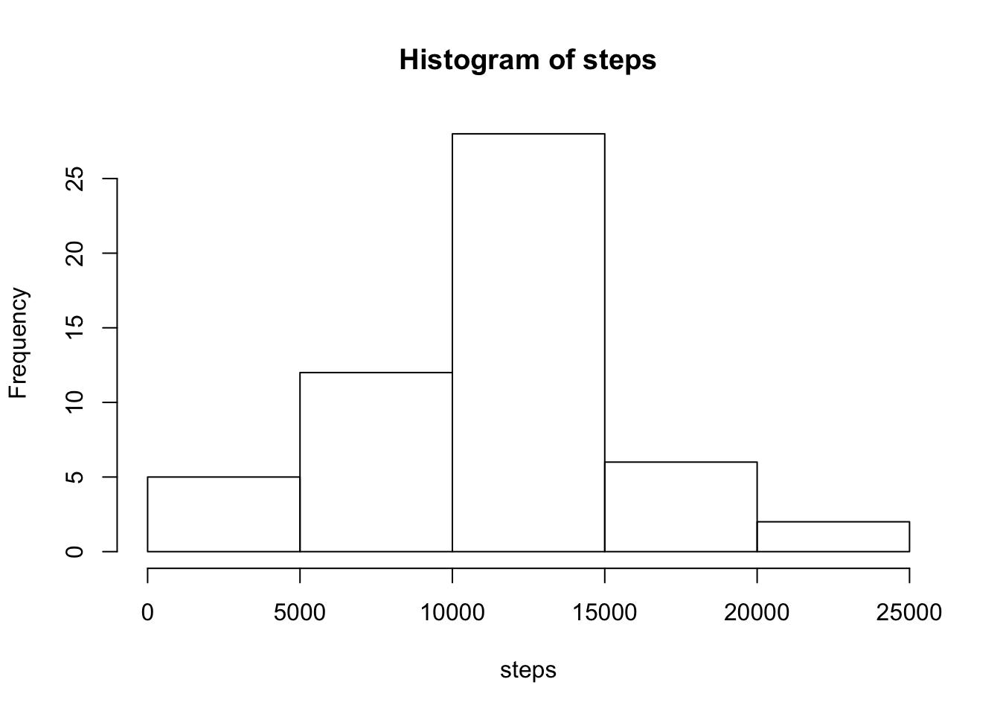
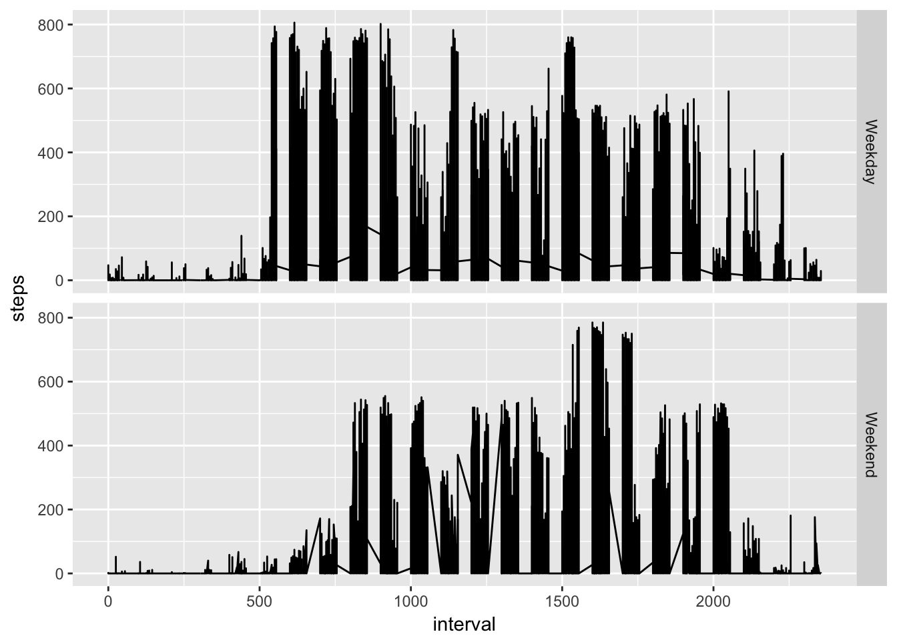

---
output:
  html_document: default
  pdf_document: default
  word_document: default
---
## Course Project 1 RMarkdown File

Read the activity data file and transform date.

```r
setwd("~/Documents/Coursera/RepResearch/CourseProject1")
acta <- read.csv("activity.csv")
act <- na.omit(acta)
act$date <- as.Date(act$date)
```

Total Steps Summed per Day

```r
steps <- tapply(act$steps, act$date, sum)
print(steps)
```

```
## 2012-10-02 2012-10-03 2012-10-04 2012-10-05 2012-10-06 2012-10-07 
##        126      11352      12116      13294      15420      11015 
## 2012-10-09 2012-10-10 2012-10-11 2012-10-12 2012-10-13 2012-10-14 
##      12811       9900      10304      17382      12426      15098 
## 2012-10-15 2012-10-16 2012-10-17 2012-10-18 2012-10-19 2012-10-20 
##      10139      15084      13452      10056      11829      10395 
## 2012-10-21 2012-10-22 2012-10-23 2012-10-24 2012-10-25 2012-10-26 
##       8821      13460       8918       8355       2492       6778 
## 2012-10-27 2012-10-28 2012-10-29 2012-10-30 2012-10-31 2012-11-02 
##      10119      11458       5018       9819      15414      10600 
## 2012-11-03 2012-11-05 2012-11-06 2012-11-07 2012-11-08 2012-11-11 
##      10571      10439       8334      12883       3219      12608 
## 2012-11-12 2012-11-13 2012-11-15 2012-11-16 2012-11-17 2012-11-18 
##      10765       7336         41       5441      14339      15110 
## 2012-11-19 2012-11-20 2012-11-21 2012-11-22 2012-11-23 2012-11-24 
##       8841       4472      12787      20427      21194      14478 
## 2012-11-25 2012-11-26 2012-11-27 2012-11-28 2012-11-29 
##      11834      11162      13646      10183       7047
```

Histogram of Steps per Day

```r
hist(steps)
```



Mean and Median Steps per Day

```r
mean(steps)
```

```
## [1] 10766.19
```

```r
median(steps)
```

```
## [1] 10765
```

Time Series, Mean Number of Steps per 5-minute Interval

```r
int <- as.data.frame.table(tapply(act$steps, act$interval, mean))
colnames(int) <- c("interval", "Steps")
plot(int, type = "1")
```


5-minute Interval with Highest # of Steps on Average

```r
apply(int, MARGIN = 2, FUN = function(x) max(x))
```

```
##      interval         Steps 
##         "955" "206.1698113"
```

Total Number of Missing Values in Dataset

```r
mv <- is.na(acta)
sum(mv)
```

```
## [1] 2304
```

Creating a New Dataset with all Missing Values Replaced by Mean Value of Interval

```r
actar <- acta
for(i in 1:nrow(actar)) {
    if(is.na(actar[i, 1]) == TRUE) {
        actar[i, 1] <- with(int, subset(Steps, int$interval == actar[i, 3]))
    }
}
actar$date <- as.Date(actar$date)
```

Histogram of Steps per Day with Missing Values Imputed

```r
stepars <- tapply(actar$steps, actar$date, sum)
hist(stepars)
```


Mean and Median Steps per Day with Missing Values Imputed 

```r
mean(stepars)
```

```
## [1] 10766.19
```

```r
median(stepars)
```

```
## [1] 10766.19
```

Imputing missing values increased the frequency of days on which an average number of steps was taken. As mean values were used as a substitute for the missing values, the overall mean and median number of steps per day did not change.


Add Name of Day Column to Dataset

```r
actar$days <- as.factor(weekdays(actar$date))
actar$dayfct <- as.factor(ifelse(actar$days == "Sunday" | actar$days == "Saturday", "Weekend", "Weekday"))
```

Panel Plot, Number of Steps Taken, Weekdays vs Weekends.

```r
library(ggplot2)
ggplot(data = actar) + geom_line(aes(x = interval, y = steps)) + facet_grid(dayfct~.)
```



It appears that overall less steps are taken on the weekends, and that the steps occur later in the day.

